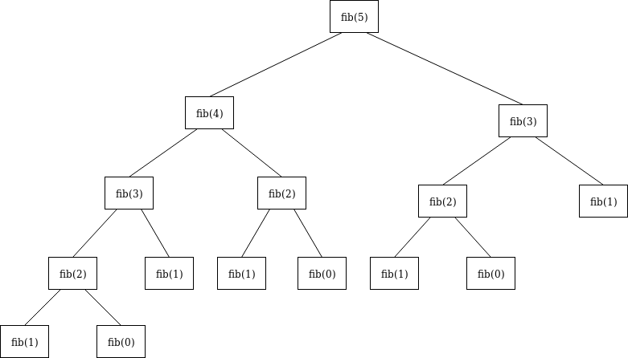

# Dynamic programming

Dynamic programming is both a mathematical optimization method and a computer programming method. The method was developed by Richard Bellman in the 1950s and has found applications in numerous fields, from aerospace engineering to economics.^[https://en.wikipedia.org/wiki/Dynamic_programming]

In both contexts it refers to simplifying a complicated problem by breaking it down into simpler sub-problems in a recursive manner. While some decision problems cannot be taken apart this way, decisions that span several points in time do often break apart recursively. Likewise, in computer science, if a problem can be solved optimally by breaking it into sub-problems and then recursively finding the optimal solutions to the sub-problems, then it is said to have optimal substructure.

Dynamic programming is typically used when you want to solve the same subproblem again and again. Essentially, if we can reduce the large problem to subproblems, it makes sense to solve it with dynamic programming.

## Recommended reading

Chapter 7 of [Competitive Programmer's Handbook](https://cses.fi/book/book.pdf) goes through a bunch of examples.

## Fibonacci numbers

Consider the Fibonacci sequence

$$F_0 = 0, \quad F_1 = 1, \quad F_n = F_{n-1} + F_{n-2}.$$

If you write a recursive program to compute the Fibonacci sequence, then you would have something like this:

```python
def fib(self, N: int) -> int:
    if N <= 1:
        return N
    return fib(N-1) + fib(N-2)
```

But looking at the recursion tree, this can be quite slow:


Look at the amount of times we call `fib(1)`! So...why not just store the results of each `fib(i)` call (break it down into subproblems)? This is called **memoization**.

## Memoised Fibonacci numbers

```python
def fib(self, N: int) -> int:
    if N <= 1:
        return N
    return memoize(N)

def memoize(self, N: int) -> {}:
    cache = {0: 0, 1: 1}

    for i in range(1, N):
        cache[i+1] = cache[i] + cache[i-1]

    return cache[N]
```

## Another example: dice combinations

[https://cses.fi/problemset/task/1633](https://cses.fi/problemset/task/1633)

> Your task is to count the number of ways to construct sum n by throwing a dice one or more times. Each throw produces an outcome between 1 and 6. For example, if `n=3`, there are `4` ways:
> 
> - `1+1+1`
> - `1+2`
> - `2+1`
> - `3`
> 
> Print the number of ways modulo `10^9 + 7`.

```python
n = int(input())

mod = 10e9 + 7

dp = []

# n = 1 : 1
# n = 2 : 1+1 or 2
# n = 3 : 1+1+1 or 1+2 or 2+1 or 3
# (number of ways to make 2 + number of ways to make 1)
# n = 4 : 1+1+1+1 or 1+2+1 or 2+1+1 or 1+1+2 or 2+2 or 3+1 or 1+3 or 4
# (number of ways to make 3 + number of ways to make 2 + number of ways to make 1)

# dp is our array of answers, we build it bottom up.
# dp[0] = 1, dp[1] = 1.
# dp[n] = dp[n-1] + dp[n-2] + dp[n-3] + dp[n-4] + dp[n-5] + dp[n-6]

# always good to sit down with pen and paper and try to work out the recursion first,
# and then optimise later.

dp.append(1)
dp.append(1)

# build bottom up to n.
for i in range(2, n+1):
    sum = 0
    for j in range(1, 6+1):
        if i-j >= 0:
            sum += dp[i-j]
    dp.append(int(sum % mod))

print(dp[n])
```

## Questions

- [Minimising Coins](https://cses.fi/problemset/task/1634)
- [Coin Combinations I](https://cses.fi/problemset/task/1635)
- [Coin Combinations II](https://cses.fi/problemset/task/1636)
- [Removing Digits](https://cses.fi/problemset/task/1637)
- [Grid Paths](https://cses.fi/problemset/task/1638)

If you are ever stuck (for a decent amount of time), it might be worth having a look at [this Codeforces blog](https://codeforces.com/blog/entry/70018).