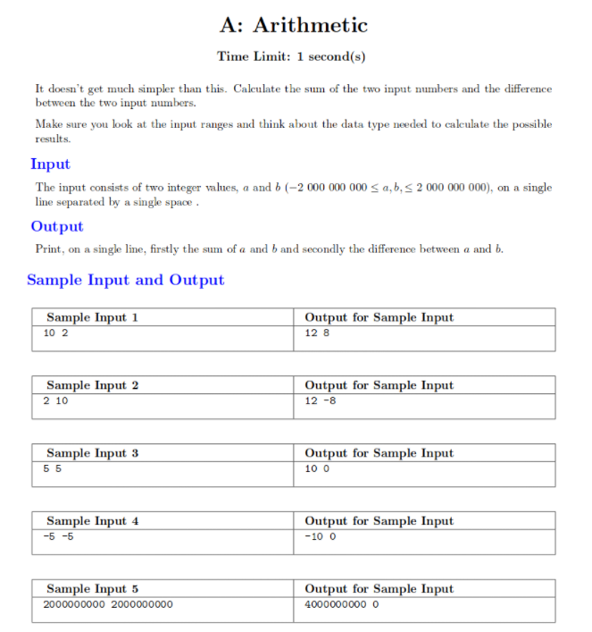
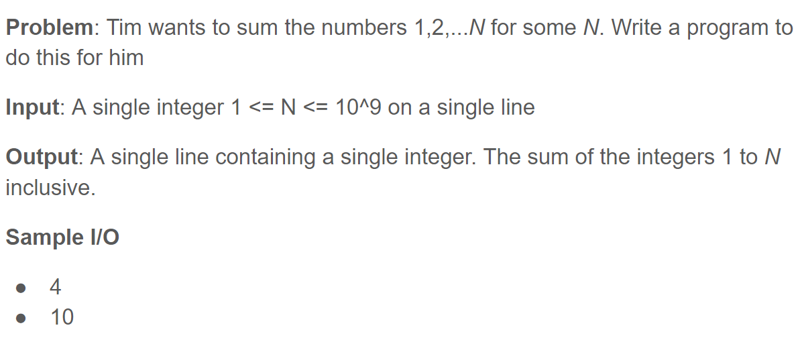

Table of contents:
- [Welcome to CPG!](#welcome-to-cpg)
- [Why do competitive programming?](#why-do-competitive-programming)
- [What is (official) competitive programming?](#what-is-official-competitive-programming)
- [Question format](#question-format)
- [Example questions](#example-questions)
- [Practicing](#practicing)
- [Questions](#questions)
- [References](#references)

---

## Welcome to CPG!

The aim of this group is to get practice with programming questions (like those found on LeetCode or HackerRank) and to apply these skills to programming competitions throughout the semester/year, such as

- Google Code Jam
- Google Kickstart
- UQCS Code Jam (!)
- Advent of Code
- and (potentially) also team-based competitions, such as

- ANZAC
- ICPC (International Collegiate Programming Contest).

We meet on a weekly basis to discuss and work through challenging and interesting programming problems, gaining some valuable experience for technical interviews along the way!

## Why do competitive programming?

- Keeps your mind sharp
- Efficient way to learn core CS topics (e.g. topics covered in COMP3506)
- Lots of programming experience (especially for programming courses like CSSE1001 :eyes:)
- Fun!
- Practically useful (great for technical interviews)

## What is (official) competitive programming?

**Main format**:

- [International Collegiate Programming Contest](https://icpc.global/) (ICPC) style
- 3 people per team, 1 machine
- 10-15 problems
- 5 hours
- Python, C++, Java, or Kotlin

**Other formats/competitions**:
- Individual contests
- Google CodeJam
- Google KickStar
- UQCS CodeJam
- CodeForces
- HackerRank

See https://sppregional.org/ and https://www.facebook.com/groups/SPPContest/ for more info

## Question format

- **Flavour text**
  - Prose description of the problem
  - Worth reading as key restrictions and details are put here
- **Time and memory limit**
  - Used to determine how efficient your solution needs to be (see [Big O notation](https://en.wikipedia.org/wiki/Big_O_notation), [time complexity](https://en.wikipedia.org/wiki/Time_complexity), and [space complexity](https://en.wikipedia.org/wiki/Space_complexity) - we'll cover this later)
  - Often a naive solution (first thing that comes to mind, most obvious way to approach the problem) and a quicker solution (requires mroe time to think of, usually more elegant)
- **Input and output**
  - For python, we use `input()` and `print()` as our standard I/O
- **Sample input and output**
  - Gives you sample answers and an idea of I/O format

## Example questions



**How to solve?**

1. Read in the two values
2. Add them and subtract them
3. Print out the answers

We want to read in the two inputs and save them as variables `a` and `b`. One way to do this is:

```python
a, b = map(int, input().split())
```

**How does this work?**

1. Take sample input 1 for example. `input()` takes in the input as a string: `"10 2"`

2. `split()` splits the string into a list separated by spaces: `["10", "2"]`

3. We can then iterate through the list using `map()`, executing `int()` on each element

4. Finally, assign the mapping to two variables `a` and `b`

Now that we have successfully read in the input, the rest is trivial:

```python
print(a+b, a-b)
```



**How to solve?**

Firstly, the **naive solution**:

```python
n = int(input())
out = 0

for i in range(1, n+1):
    out += i

print(out)
```

This is the most straight-forward to approach this problem and is (probably) the first one that came to mind.

However, it's not very fast. As the input `n` grows larger and larger, the program has to execute more and more loops, which isn't great. We'd likely hit the time limit for larger values of `n`.

A better way to approach this solution would be to find a formula for the sum $1 + ... + n$. Take some time to see if you can find one.

A better solution:

```python
n = int(input()

print(n*(n+1) // 2)  # note: use floor division (//) to ensure your output is an int!
```

## Practicing

Some websites (e.g. LeetCode) will start you off with some code like so:

```python
class Solution(object):
        def twoSum(self, nums, target):
            # your code here
```

**While this is convenient, it's important to learn how to read from/write to input/output and to learn how to parse inputs!**

Most contests won't give you the luxury of parsing input for you. It's also generally a useful thing to learn anyway, so you might as well learn it.

We'll cover more examples of reading from standard input next week!

## Questions

You can start off by doing some of the introductory problems on CSES's problem set [here](https://cses.fi/problemset/). These questions do get challenging quick though, so if you'd prefer some easier ones to begin with you can also try Hackerrank's library of Python questions [here](https://www.hackerrank.com/domains/python) (bonus: we'll be using Hackerrank to run our mini CPG competitions throughout the semester :wink:)

---

## References

[Introduction to Competitive Programming slides](https://docs.google.com/presentation/d/1da1D3QWyamfiAGhpiqB7N1K3vCFqK2hiA2eg60J_SvY/)