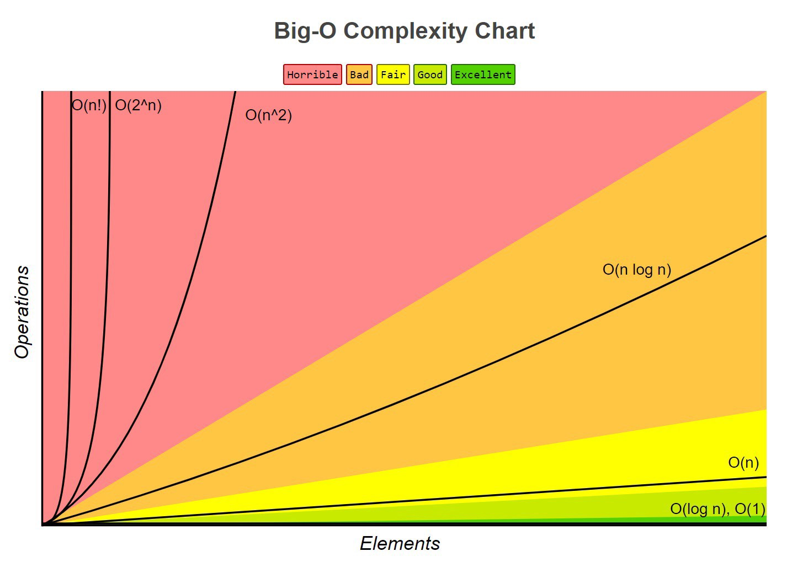

# Sorting and searching

## Agenda

- How was Code Jam?
- Next round 1B April 26 2am (...lol)
- Round 1C May 1 7pm

## Agenda

- A crash course in complexity
- Sorting
- Binary search
- Two pointers
- Do some problems!

## A crash course in complexity



<!-- ](complexity.png) -->

`O(...)` is a rough estimate of how an algorithm performs as input size increases.

```
O(1) < O(log n) < O(n) < O(n log n) < O(n^2) < O(2^n) < O(n!)
```

Examples of these complexities in practice:

- `O(1)`: lookup table, check if number is odd.
- `O(log n)`: binary search (see soon).
- `O(n)`: naive search through an array.
- `O(n log n)`: fastest sort.
- `O(n^2)`: naive two-sum (see soon).
- `O(2^n)`: list all combinations of a list.
- `O(n!)`: list all permutations of a list.

It's good to remember these estimates for maximum input sizes for `1s` (i.e. is your brute force solution gonna work?)

- `O(n!)`: `n <= 10`
- `O(2^n)`: `n <= 20`
- `O(n^3)`: `n <= 500`
- `O(n^2)`: `n <= 5000`
- `O(n log n)` or `O(n)`: `n <= 10^6`
- `O(1)` or `O(log n)`: any large `n` (you can't get better than this for competitive programming).

## Sorting

- Not gonna go over sorting algorithms (see COMP3506 for this).
- Sometimes knowledge of different sorting algorithms may be useful, but for now, know that _sorting can sometimes be useful_.
- Why?
- **Binary search**.

## Binary search

Say you have a list

```
[1, 2, 3, 4, 10, 8, 7, 9, 2, 5]
```

How do I find 7? No way to do so easily. I have to iterate over the whole list. This is `O(n)` for a list of length `n`, so not ideal.

Instead, what if we sort through the list?

```
[1, 2, 2, 3, 4, 5, 7, 8, 9, 10]
```

...and then go to the middle, and split the list in two based on whether the middle number is bigger or smaller (or equal, in which case we stop)?

> *Note:* We don't actually need to split the list, we can just adjust our bounds. See below implementation

```
[1, 2, 2, 3, 4] [5, 7, 8, 9, 10]
[5, 7, 8] [9, 10]
middle = 7
```
Here it took us only _two_ steps to find 7, whereas above it took us 7!

**Binary search is `O(log n)`.** This is faster than `O(n)`. 

> *Note:* how you split a list is implementation-specific, just make sure you're roughly splitting it in half.

Can be implemented as follows:

```python
def binary_search(arr, low, high, x):
    if high >= low:
        mid = (high + low) // 2
        if arr[mid] == x:
            return mid
        elif arr[mid] > x:
            return binary_search(arr, low, mid - 1, x)
        else:
            return binary_search(arr, mid + 1, high, x)
    else:
        return -1
```

## Two pointers

Let's look at an example problem: two sum.

> Given an array of integers, and a target value, find if there exist two (distinct) integers such that their sum is equal to X.

This can be solved naively using a double for-loop:

```python
def two_sum(arr, target):
    for i in range(len(arr)):
        for j in range(len(arr)):
            if i != j and arr[i] == arr[j]:
                return True
    return False
```

but (if we remember from complexity) this is actually `O(n^2)`. This isn't very good, we'd like an `O(n log n)` solution!

Let's first sort the list, and then let's start with the widest possible pair and refine the sum.

- If the sum is too big, move the right-hand pointer down.
- If the sum is too small, move the left-hand pointer up.

```python
def two_sum(arr, target):
    i = 0
    j = len(arr)
    while i < j:
        if arr[i] + arr[j] == target:
            return True
        elif arr[i] + arr[j] < target:
            i += 1
        else:
            j -= 1
    return False
```

Sorting is `O(n log n)`, this search is `O(n)`, so this algorithm in total has complexity `O(n log n + n) = O(n log n)`, which beats `O(n^2)`!

This concept can be applied to much more than two sum, but the idea is: refine your pointers until you reach the desired target.

> *Note.* You can actually do better than this with a two-pass dictionary method `O(n)`.
> 
> ```python
> def two_sum(arr, target):
>     index_map = {}
>     for i, n in enumerate(arr):
>         comp = target - n
>         if comp in index_map and index_map[comp] != i:
>             return True
>         index_map[n] = i
>     return False
> ```
> 
> We store in the dictionary index_map k,vs of the form: `[n, i]`. Then we calculate `target-n` and check if it's in the dictionary.

## Questions

This should be plenty:

- [Distinct Numbers](https://cses.fi/problemset/task/1621)
- [Sum of Three Values](https://cses.fi/problemset/task/1641)
- [Concert Tickets](https://cses.fi/problemset/task/1091)
- [Traffic Lights](https://cses.fi/problemset/task/1163)
- [Room Allocation](https://cses.fi/problemset/task/1164)
- [Factory Machines](https://cses.fi/problemset/task/1620)
- [Array Division](https://cses.fi/problemset/task/1085)