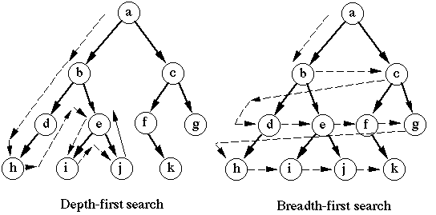

# Graph algorithms

Graphs come up a lot in competitive programming. They consist of nodes and edges between nodes (either directed and undirected, and either weighted or unweighted), and can be used for a number of real-world modelling problems.



## Recommended reading

Chapter 11, *Basics of graphs*, and Chapter 12, *Graph traversal*, from *Competitive Programmer's Handbook*.

## How to represent a graph

There are two common methods of representing graphs:

- **Adjacency lists** list nodes of a graph as keys and the nodes that they are connected to as values.
- **Adjacency matrices** are `n`x`n` matrices (where `n` is the number of nodes) where a 1 (or the weight for a weighted graph) is placed in matrix entry `m[i][j]` if a node `i` is connected to node `j`.

In Python, an adjacency list would be represented with a dictionary and an adjacency matrix would be a 2D list 

```python
adj = {a: [b, c, d], ...}
adj = [[a, b, c], [d, e, f], ...]
```

In C++, we would use

```cpp
vector<int> adj[N];
int adj[N][N];
```

## Code for DFS and BFS

Code from [here](https://www.educative.io/edpresso/how-to-implement-depth-first-search-in-python) and [here](https://www.educative.io/edpresso/how-to-implement-a-breadth-first-search-in-python). This code is assuming you are using an adjacency-list representation, but an adjacency-matrix representation version can also be written in Python. C++ code is available in *Competitive Programmer's Handbook*.

### Depth-first search

```python
def dfs(visited, graph, node):
    if node not in visited:
        print(node)
        visited.add(node)
        for neighbour in graph[node]:
            dfs(visited, graph, neighbour)
```

### Breadth-first search

```python
def bfs(visited, graph, node):
    visited.append(node)
    queue.append(node)

    while queue:
        s = queue.pop(0)
        print(s)
        for neighbour in graph[s]:
            if neighbour not in visited:
                visited.append(neighbour)
                queue.append(neighbour)
```

### Note

You might experience runtime errors/TLE on some graph problems in Python. Most solutions on the internet for competitive programming problems are in C++, so now would be a good time to try out C++ for some of these problems. If you set it up properly, you can develop C++ on your machine just as quickly as Python. If you need help setting it up, just let me know :)